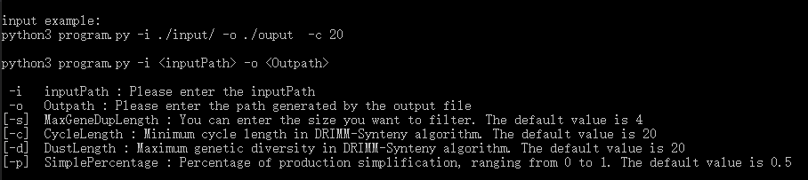

# Ds-Builder-Linux

## 安装mono

由于Drimm-Synteny是C#代码基于.Net不方便在Linux环境运行，我们寻找出了一套可以使.Net在Linux环境中编译运行的方式，使用Mono。

Mono是一个由微软赞助，是一个基于c#标准运行库的.NET的开源框架，它允许开发者使用跨平台.net应用程序。

* 如在宿主机中使用以下命令进行安装

```bash
sudo apt install mono-devel
```

* 如在conda环境中使用以下命令

```bash
conda install -n XXX镜像名 -c conda-forge mono
```

安装后，输入以下命令，验证安装是否成功

```bash
mono -v
```

## 编译（已完成）如需修改Drimm算法代码，请参考此步骤

我们已经在./utils文件夹中提供Program.cs的源码，且已经编译成Program.exe文件，如需修改源码，使用以下命令进行编译

```bash
mcs Program.cs
```

## 安装pandas

```bash
conda install -n XXX镜像名 pandas
```

## 运行

```bash
python3 program.py
```

出现以下界面即可



使用默认命令，在input文件夹已经含有输入的示例文件，可以参考示例文件格式进行计算。

```bash
python3 program.py -i ./input/ -o ./ouput  -c 20
```
